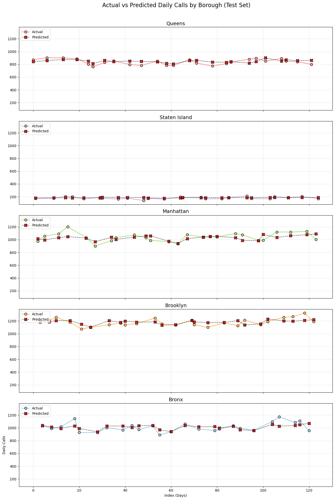

# NYC Ambulance Call Volume Prediction

Predicting daily ambulance call demand across New York City's boroughs using EMS dispatch data, weather conditions, and holiday indicators.

---

##  Project Objective

Forecast **daily ambulance call volume** for each NYC borough to improve:

- 🚑 EMS resource allocation
- 👨‍⚕️ Staffing during high-demand periods
- ⏱️ Response time efficiency

Accurate predictions help NYC EMS be better prepared — especially on weekends, holidays, and weather-impact days.
---

##  Context

New York City’s EMS handles thousands of 911 calls daily. These calls vary significantly depending on:

- **Time factors** (weekday, weekend, holidays)
- **Weather conditions** (temperature, snowfall, rain)
- **Geographic location** (borough-specific demand)

By building a machine learning model, this project aims to predict call volume patterns using historical data and external features.

---
## 🧠 Modeling Approach

The project explored **two separate modeling strategies**:

1. **Citywide Model**  
   - Aggregated all boroughs together  
   - Served as a baseline to understand overall demand trends  
   - Models tested: Linear Regression, XGBoost
   - **Final selection:** XGBoost

2. **Borough-wise Models ✅**  
   - Separate model trained for each borough  
   - Captures **local patterns & variability**  
   - Models tested: Linear Regression, Prophet, XGBoost  
   - **Final selection:** XGBoost for each borough (best accuracy)

Main features used:
- Day of week, weekends, holidays
- Temperature, precipitation, snowfall
- Lagged and rolling call volume patterns

---
## 📈 Results & Performance

The project evaluated performance at **two levels**:

### 1️⃣ Citywide Model
- Aggregated all boroughs to predict overall NYC demand  
- Served as a **baseline** for comparison  
- Performance (example metrics):

| Model | RMSE | MAE |
|-------|------|-----|
| Linear Regression | 62.90 | XX |
| XGBoost | 47.84 | 36.93 |

The model demonstrates strong generalization performance with low forecast error (RMSE ≈ 48, MAE ≈ 37). 

## 📌 Visual Highlights

### Actual vs Predicted - Citywide


---

### 2️⃣ Borough-wise Models ✅
- Separate model trained for each borough using XGBoost (best performing)  
- Captures **local demand patterns** → improved prediction accuracy

| Borough       | RMSE (XGBoost) | R² (XGBoost) | RMSE (Prophet) | R² (Prophet) |
|---------------|----------------|--------------|----------------|--------------|
| Bronx         | 55.32          | 0.38         | 58.01          | 0.29         |
| Brooklyn      | 58.59          | 0.18         | 62.91          | -0.09        |
| Manhattan     | 72.94          | -0.09        | 72.42          | -0.19        |
| Queens        | 44.07          | -0.13        | 43.79          | -0.15        |
| Staten Island | 16.88          | -0.10        | 20.25          | -0.53        |

- Bronx: The model captures overall demand trends, with moderate accuracy, though short-term spikes occasionally deviate from predictions.
- Brooklyn: Predictions follow general patterns, but high variability in daily calls reduces model precision.
- Manhattan: The model struggles with highly volatile demand, resulting in lower predictive reliability.
- Queens: Forecasts capture broad trends, but sparse or irregular demand makes short-term predictions less accurate.
- Staten Island: Lower call volume allows the model to predict trends more consistently, though some fluctuations remain.

## 📌 Visual Highlights

### Actual vs Predicted - Borough wise


## 📁 Repository Structure
---
```bash
├── README.md                     # Project overview and documentation
├── data/
│   ├── daily_ambulance_calls.csv       # Aggregated EMS data (daily borough-level call volume)
│   ├── nyc_boroughs_weather.csv          # Daily weather data for NYC
├── 1_data_wrangling.ipynb        # Load & clean EMS data, add weather & holiday features
├── 2_eda.ipynb                   # Visual exploration of trends, patterns, borough-level insights
├── 3_preprocessing.ipynb         # Final feature selection, encoding, normalization, train/test split
├── 4_modeling.ipynb              # Training & evaluating models (Linear Regression, Prophet, XGBoost)
├── 5_report.md                   # Written summary of methodology, results, and key findings
├── 6_presentation_slides.pdf     # Presentation slides for stakeholders
├── assets/                       # Images or visualizations used in report/README
└── requirements.txt              # Python package dependencies


## Data Sources
EMS Dispatch Data (Jun 1, 2024 – Apr 15, 2025)
NYC Open Data API – EMS Incident Dispatch
url = "https://data.cityofnewyork.us/resource/76xm-jjuj.json"
⮑ 1308614 rows retrieved via API, aggregated to daily call counts.
Weather Data
Daily NYC weather observations (temperature, precipitation, snowfall, etc.)
Holiday Calendar
U.S. federal and NY state holidays, used to flag public/non-working days.
