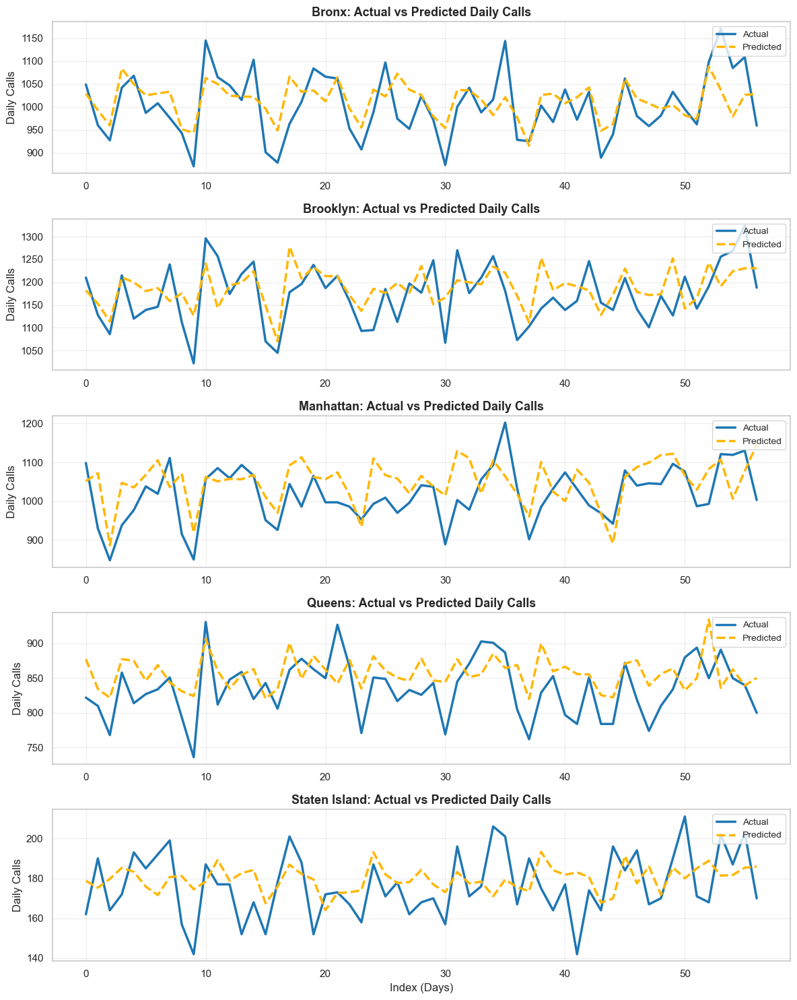

# NYC Ambulance Call Volume Prediction
New York City operates one of the busiest emergency medical services in the world, handling hundreds of thousands of ambulances calls annually across its five boroughs: Bronx, Brooklyn, Manhattan, Queens, and Staten Island. The NYC 911 ambulance service provides rapid medical response for emergencies ranging from injuries and cardiac events to critical illnesses, often operating under highly variable demand conditions.


---

##  Project Objective
Predict **daily ambulance call demand** across New York City's boroughs using EMS dispatch data, weather conditions, and holiday indicators to improve:

- 🚑 EMS resource allocation
- 👨‍⚕️ Staffing during high-demand periods
- ⏱️ Response time efficiency

Accurate predictions help NYC EMS be better prepared — especially on weekends, holidays, and weather-impact days.
---

##  Context

New York City’s EMS handles thousands of 911 calls daily. These calls vary significantly depending on:

- **Time factors** (weekday, weekend, holidays)
- **Weather conditions** (temperature, snowfall, rain)
- **Geographic location** (borough-specific demand)

By building a machine learning model, this project aims to predict call volume patterns using historical data and external features.

---
## 🧠 Modeling Approach

The project explored **two separate modeling strategies**:

1. **Citywide Model**  
   - Aggregated all boroughs together  
   - Served as a baseline to understand overall demand trends  
   - Models tested: Linear Regression, XGBoost
   - **Final selection:** XGBoost

2. **Borough-wise Models ✅**  
   - Separate model trained for each borough  
   - Captures **local patterns & variability**  
   - Models tested: Linear Regression, Prophet, XGBoost  
   - **Final selection:** XGBoost for each borough (best accuracy)

Main features used:
- Day of week, weekends, holidays
- Temperature, precipitation, snowfall
- Lagged and rolling call volume patterns

---
## 📈 Results & Performance

The project evaluated performance at **two levels**:

### 1️⃣ Citywide Model
- Aggregated all boroughs to predict overall NYC demand  
- Served as a **baseline** for comparison  
- Performance (example metrics):

| Model | RMSE | MAE |
|-------|------|-----|
| Linear Regression | 62.90 | XX |
| XGBoost | 47.84 | 36.93 |

The model demonstrates strong generalization performance with low forecast error (RMSE ≈ 48, MAE ≈ 37). 

## 📌 Visual Highlights

### Actual vs Predicted - Citywide


---

### 2️⃣ Borough-wise Models ✅
- Separate model trained for each borough using XGBoost (best performing)  
- Captures **local demand patterns** → improved prediction accuracy

| Borough       | RMSE (XGBoost) | R² (XGBoost) | RMSE (Prophet) | R² (Prophet) |
|---------------|----------------|--------------|----------------|--------------|
| Bronx         | 55.32          | 0.38         | 58.01          | 0.29         |
| Brooklyn      | 58.59          | 0.18         | 62.91          | -0.09        |
| Manhattan     | 72.94          | -0.09        | 72.42          | -0.19        |
| Queens        | 44.07          | -0.13        | 43.79          | -0.15        |
| Staten Island | 16.88          | -0.10        | 20.25          | -0.53        |

- Bronx: The model captures overall demand trends, with moderate accuracy, though short-term spikes occasionally deviate from predictions.
- Brooklyn: Predictions follow general patterns, but high variability in daily calls reduces model precision.
- Manhattan: The model struggles with highly volatile demand, resulting in lower predictive reliability.
- Queens: Forecasts capture broad trends, but sparse or irregular demand makes short-term predictions less accurate.
- Staten Island: Lower call volume allows the model to predict trends more consistently, though some fluctuations remain.

## 📌 Visual Highlights

### Actual vs Predicted - Borough wise

---
## Conclusion
This project developed predictive models for NYC ambulance demand at citywide and borough levels.
Citywide XGBoost achieved strong performance (RMSE 47.84, R² 0.98, MAPE 5.09%), outperforming linear regression.
- Borough-level XGBoost captured local trends and outperformed Prophet, with Manhattan showing higher errors due to data variability.
- SHAP analysis highlighted nonlinear feature interactions, e.g., temperature influencing certain boroughs despite low correlation in EDA.
---
## 🔧 Future Improvements
- Add external features: public events, demographics, traffic, population density.
- Explore advanced temporal models: LSTM, Temporal Fusion Transformers for complex sequential patterns.
- Use finer-grained data: neighborhood-level or hourly call data for better local accuracy.
- Build an interactive dashboard for real-time monitoring of forecasts and feature contributions.

---
## 📁 Repository Structure
---
```bash
├── README.md                        # Project overview and documentation
├── data/
│   ├── daily_ambulance_calls.csv    # Aggregated EMS data (daily borough-level call volume)
│   └── nyc_boroughs_weather.csv     # Daily weather data for NYC
├── 1_data_wrangling.ipynb           # Load & clean EMS + add weather & holiday features
├── 2_eda.ipynb                      # Visual exploration of trends & borough-level insights
├── 3_preprocessing.ipynb            # Feature engineering & train-test split
├── 4_modeling_citywide.ipynb        # Linear Regression & XGBoost (Citywide demand)
├── 5_modeling_borough_wise.ipynb    # XGBoost + Prophet (Borough-level forecasts)
├── 6_Report.md                      # Full technical report with detailed evaluation
├── 7_presentation.pdf               # Stakeholder presentation with highlights
├── assets/                          # Images, charts, GIFs used in README/report
│  
└── requirements.txt                 # Python package dependencies


## Data Sources
EMS Dispatch Data (Jun 1, 2024 – Apr 15, 2025)
NYC Open Data API – EMS Incident Dispatch
url = "https://data.cityofnewyork.us/resource/76xm-jjuj.json"
⮑ 1308614 rows retrieved via API, aggregated to daily call counts.
Weather Data
Daily NYC weather observations (temperature, precipitation, snowfall, etc.)
Holiday Calendar
U.S. federal and NY state holidays, used to flag public/non-working days.
